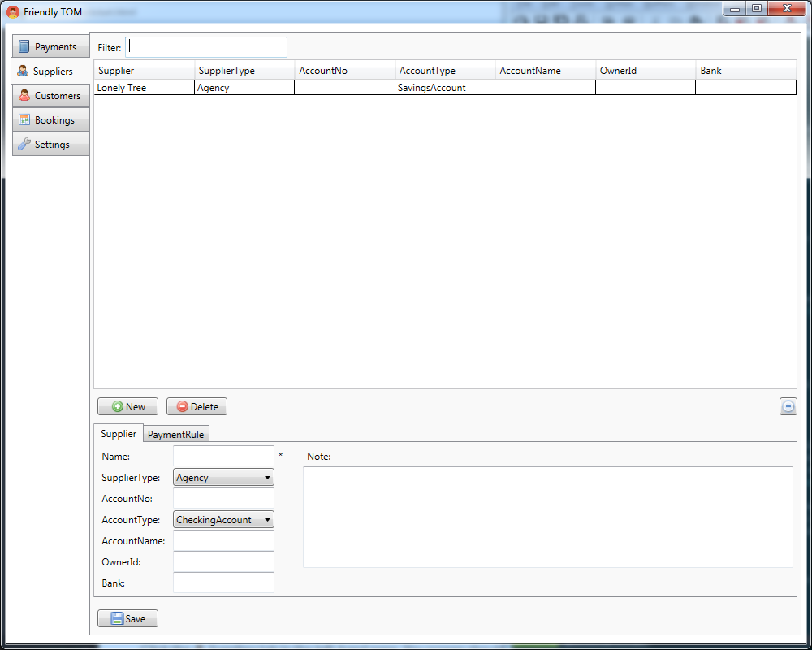
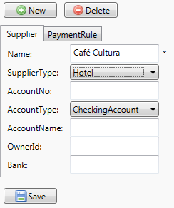
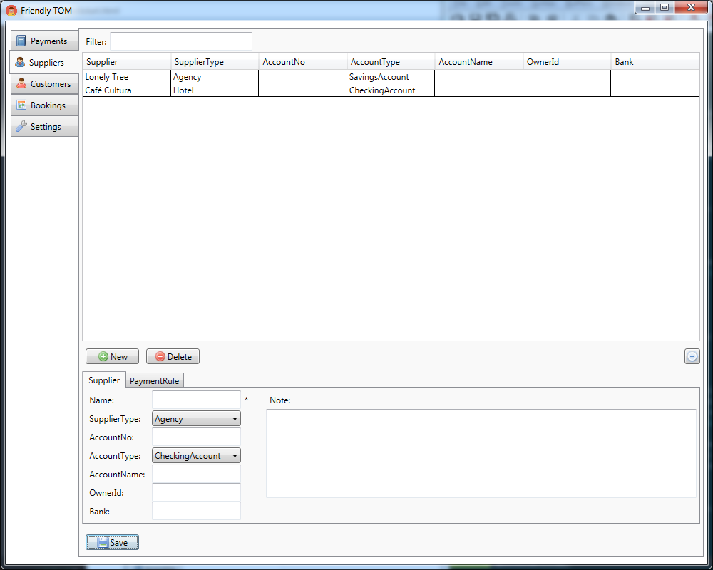

.. |Save| replace:: |Save-icon| :guilabel:`Save`
.. |New| replace:: |New-icon| :guilabel:`New`
.. |Delete| replace:: |Delete-icon| :guilabel:`Delete`
.. |Customers| replace:: |Customer-icon| :guilabel:`Customers`
.. |Suppliers| replace:: |Supplier-icon| :guilabel:`Suppliers`
.. |PaymentRules| replace:: :guilabel:`Payment Rules`

.. |New-icon| image:: images/icons/new.png
.. |Save-icon| image:: images/icons/save.png
.. |Delete-icon| image:: images/icons/delete.png
.. |Customer-icon| image:: images/icons/customer.png
.. |Supplier-icon| image:: images/icons/supplier.png

Quickstart
==========

You have installed Friendly TOM and you are ready to start using it. So let's
get started! First launch the program by clicking :menuselection:`Start --> All programs --> 
Friendly TOM --> Friendly TOM`. You should see something like this:

.. image:: images/friendlytom-firstrun.png

As mentioned in the :ref:`introduction` Friendly TOM helps you manage your
bookings and payments. However, in order to add bookings and payments you first
need to add a customer and a supplier. For this quickstart we'll imagine we're 
adding a booking for ``Awesome Travels`` at the ``Café Cultura`` hotel. We'll
start by adding your first customer. 

Adding A Customer
-----------------

Click the |Customers| tab in the left-hand pane. You screen should now look like 
this:

.. image:: images/yourfirstcustomer.png

The two customers already listed have been added by the system and are used to
represent two special customers: ``Lonely Tree`` is your own company and
``Any`` will be used to represent any customer - we'll get back to that later.

You can add your own customer by entering the name of the customer and 
selecting an appropriate customer type. Let's add the bureau 
called ``Awesome Travels``:

.. image:: images/addawesometravels.png

Now click |Save| to add the customer:

Next it's time to add a Supplier.

Adding A Supplier
-----------------

Click the |Suppliers| tab in the left-hand pane. You screen should now look like 
this:

Again, ``Lonely Tree`` has already been added, and is used to represent your
own company.

Just like you did with the customer, you add a supplier by filling in the name
of the supplier and selecting the type of the supplier. Let's add ``Café
Cultura``:

And after clicking |Save| you'll see it has been added to the list of
suppliers:

Before we add the booking, let's add the gældende payment rules (glossary?) 
between ``Awesome Travels`` ``Café Cultura``.      

Adding a Payment Rule
---------------------

Click the |PaymentRules| tab below the |New| and |Delete| buttons. 

add payment rule, note about any

then added booking and make payments

Sample workflow

Creating your first Customer|Supplier|Booking|Payment
