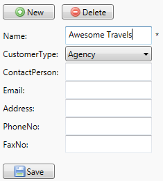
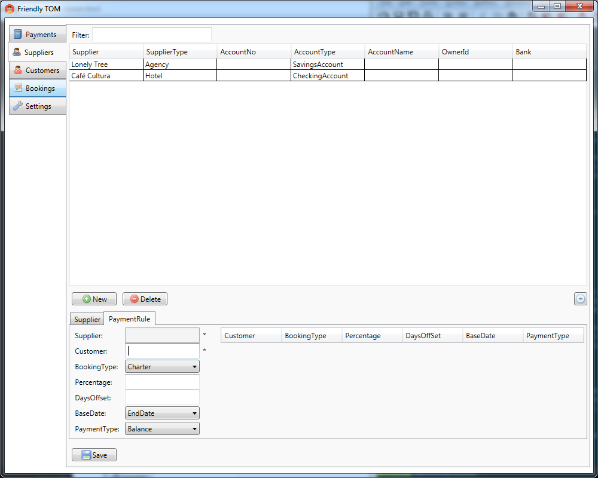
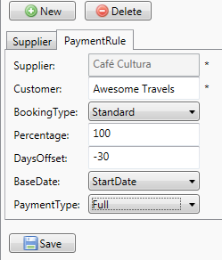
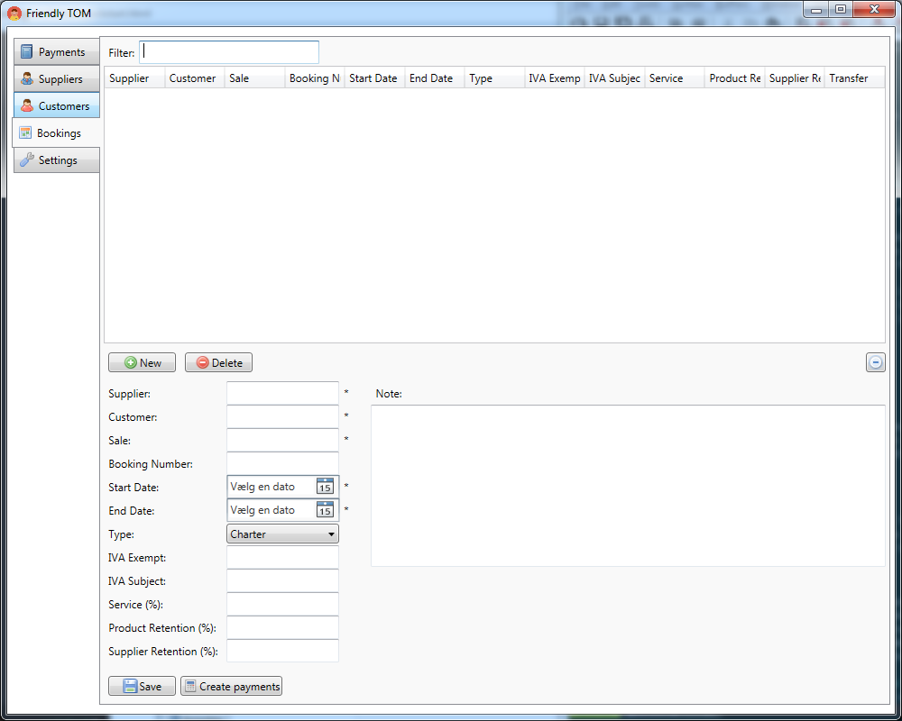

.. |Save| replace:: |Save-icon| :guilabel:`Save`
.. |New| replace:: |New-icon| :guilabel:`New`
.. |Delete| replace:: |Delete-icon| :guilabel:`Delete`
.. |Customers| replace:: |Customer-icon| :guilabel:`Customers`
.. |Suppliers| replace:: |Supplier-icon| :guilabel:`Suppliers`
.. |PaymentRules| replace:: :guilabel:`Payment Rules`
.. |Bookings| replace:: |Booking-icon| :guilabel:`Bookings`
.. |CreatePayments| replace:: |CreatePayment-icon| :guilabel:`Create payments`
.. |Payments| replace:: |Payments-icon| :guilabel:`Payments`
.. |Outgoing| replace:: |Outgoing-icon| :guilabel:`Outgoing`
.. |Archive| replace:: |Archive-icon| :guilabel:`Archive`

.. |New-icon| image:: images/icons/new.png

.. |Delete-icon| image:: images/icons/delete.png
.. |Customer-icon| image:: images/icons/customer.png
.. |Supplier-icon| image:: images/icons/supplier.png
.. |Booking-icon| image:: images/icons/booking.png
.. |CreatePayment-icon| image:: images/icons/createpayments.png
.. |Payments-icon| image:: images/icons/payments.png
.. |Outgoing-icon| image:: images/icons/outgoing.png
.. |Archive-icon| image:: images/icons/archive.png

.. _quickstart:

Quickstart
==========

You have installed Friendly TOM and you are ready to start using it. So let's
get started! First launch the program by clicking :menuselection:`Start --> 
All programs --> Friendly TOM --> Friendly TOM`. You should see something like 
this:

As mentioned in the :ref:`introduction` Friendly TOM helps you manage your
bookings and payments. However, in order to add bookings and payments you first
need to add a customer and a supplier. For this quickstart we'll imagine we're 
adding a booking for ``Awesome Travels`` at the ``Café Cultura`` hotel. We'll
start by adding your first customer. 

Adding A Customer
-----------------

Click the |Customers| tab in the left-hand pane. You screen should now look like 
this:

.. image:: images/yourfirstcustomer.png

The two customers already listed have been added by the system and are used to
represent two special customers: ``Lonely Tree`` is your own company and
``Any`` will be used to represent any customer - we'll get back to that later.

You can add your own customer by entering the name of the customer and 
selecting an appropriate customer type. Let's add the agency 
called ``Awesome Travels``:

Note that required fields are marked with an asterisk, like :guilabel:`Name` in
the above picture.

Now click |Save| to add the customer:

.. image:: images/saveawesometravels.png

Next it's time to add a Supplier.

Adding A Supplier
-----------------

Click the |Suppliers| tab in the left-hand pane. You screen should now look like 
this:

.. image:: images/yourfirstsupplier.png

Again, ``Lonely Tree`` has already been added, and is used to represent your
own company.

Just like you did with the customer, you add a supplier by filling in the name
of the supplier and selecting the type of the supplier. Let's add ``Café
Cultura``:

.. image:: images/addcafecultura.png

And after clicking |Save| you'll see it has been added to the list of
suppliers:

.. image:: images/savecafecultura.png

Before we add the booking, let's add some payment rules that describe how 
payment should be done for bookings made with ``Café Cultura`` on behalf of 
``Awesome Travels``.

Adding a Payment Rule
---------------------

Click the |PaymentRules| tab below the |New| and |Delete| buttons. Now the
screen looks like this:

Now select ``Café Cultura`` in the list of suppliers and the grayed-out box
labelled Supplier is filled. In the customer field, begin typing ``Awesome 
Travels``. You'll notice that Friendly TOM will make suggestions based on what
you type, so select the one for ``Awesome Travels``.

Select :guilabel:`Standard` as booking type, enter a percentage of 100 and an 
offset of -30. The base date should be :guilabel:`StartDate` and payment type 
should be :guilabel:`Full`. Your screen should look like this:

Now you can click |Save| to add the payment rule. The rule will be added to the
list on the right:

.. note::

    How does a payment rule work?

    The payment rule you just entered works like this: Anytime a booking is
    made on behalf of ``Awesome Travels`` at ``Café Cultura``, a full payment
    should happen 30 days before the starting date of the booking.

    Payment rules are a very flexible way of describing how payment
    should be made. The point is to define the rule once and then forget about
    it - you'll no longer have to remember (or look up) these rules yourself -
    Friendly TOM will do it for you!

.. note::

    If you want to make a payment rule for a supplier that is valid for any
    customer, you should select the ``Any`` customer - makes sense, right? If
    payment rules exist for a specific customer, these will override those
    those defined for ``Any`` when creating payments for that specific
    customer.

Now that you have defined a payment rule, you can go ahead and place a booking!

Adding a Booking
----------------

Click the |Bookings| tab on the left. The screen will look like this:

Now you should add the details for the booking. Enter the name of the supplier
and customer (``Café Cultura`` and ``Awesome Travels``) - again, notice 
Friendly TOM makes suggestions based on what you type. Enter AWE01 as the name 
of the sale. You can optionally enter a booking number. 

You'll have to select the start and end date. Let's pick January 15th, 2015 as
the start date, and January 19th as the end date. The booking type should be
:guilabel:`Standard` to match the one we picked for the payment rule.

Now we have to enter the numbers for the bills: Leave :guilabel:`IVA Excempt` 
blank, put 1000 in :guilabel:`IVA Subject`, add 10 to :guilabel:`Service` and
leave the retention fields blank. It should now look like this:

Now click save to add the booking to the list. 

Since we have a payment rule defined that matches the booking, you can select
the booking you just added in the list and click |CreatePayments|. It will
seems like nothing happened, but don't be fooled!

Checking Payments
-----------------

Click the |Payments| tab in the left-hand pane. This screen shows you all
incoming payments. Then click the |Outgoing| tab in the top center and you'll
see your outgoing payments. It should look like this:

Notice that the due amount takes into account both the 10% service and 12% IVA.
The 10% service is calculated from the sum of IVA Excempt and IVA Subject
amounts, while the 12% IVA is calculated only from the IVA Subject amount.
Also note that the due date is the 16th of december - 30 days before the 15th
of january that we selected as booking start date. Perfect! 

When you have made the payment to ``Café Cultura`` you can mark the payment as
paid by selecting the payment from the list and entering the paid date, paid
amount and checking the :guilabel:`Paid` checkbox:

Remember to click |Save|! If you no longer want to see the payment in the list
of outgoing payments you can select the payment and click |Archive| to move it
into the list of archived payments.

Summary
-------

This quickstart only touched on the core functionality of Friendly TOM. Feel
free to play around with it and discover what else Friendly TOM can help you
with!
